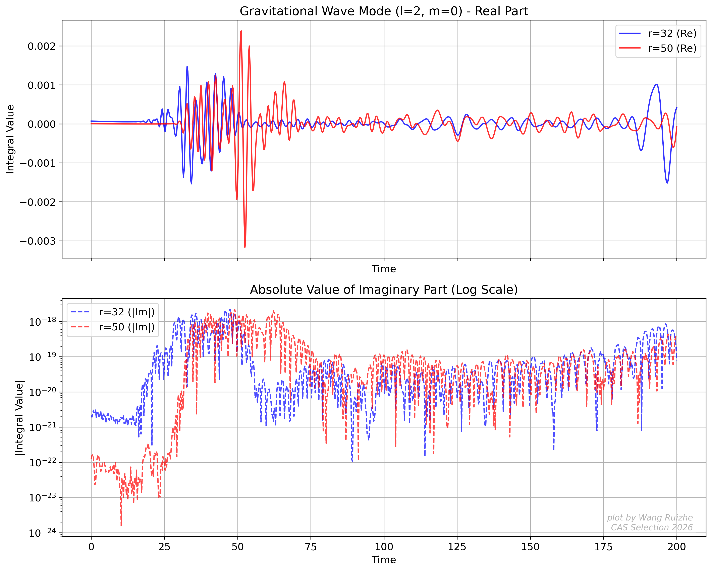
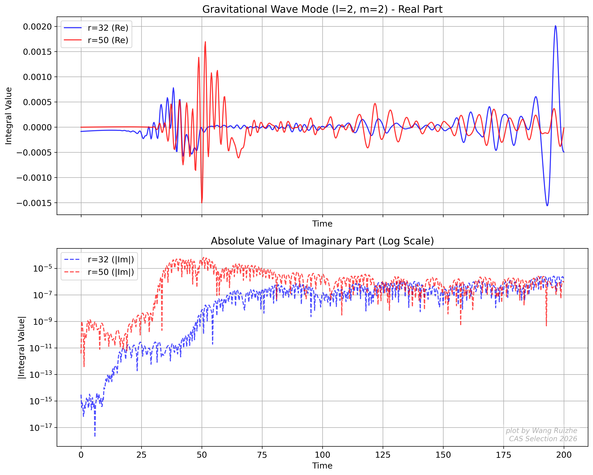

# CAS-GW-Selection-2026

## 1. Project Directory Structure (Navigation)
*   [ Task_06_LISA_Sensitivity](./Task_06_LISA_Sensitivity/) - LISA 探测器响应灵敏度
*   [ Task_07_GRChombo_Simulation](./Task_07_GRChombo_Simulation/) -基于Docker+GRChombo的双黑洞数值相对论模拟
    *   ├──[ data/](./Task_07_GRChombo_Simulation/data/)
    *   ├──[ params.txt](./Task_07_GRChombo_Simulation/params.txt)
*   [ Task_08_GRChombo_Compilation](./Task_08_GRChombo_Compilation/) - 利用个人电脑或HPC编译Chombo与GRChombo
*   [ Task_09_GRChombo_SimulationOfBinaryBH](./Task_09_GRChombo_SimulationOfBinaryBH/) - 利用个人电脑或HPC进行双黑洞模拟并提取引力波
    *   ├── [ params.txt](./Task_09_GRChombo_SimulationOfBinaryBH/params.txt)
    *   ├── [ data/](./Task_09_GRChombo_SimulationOfBinaryBH/data/)
    *   ├── [ video/](./Task_09_GRChombo_SimulationOfBinaryBH/video/)
    *   └── [ signal pattern/](./Task_09_GRChombo_SimulationOfBinaryBH/signal_pattern/)

---
## 2. Key Results & Highlights

### Task 09: GRChombo_SimulationOfBinaryBH
*   **Physical Model**: 等质量双黑洞 $M=0.5$ 正面碰撞自洽演化
*   **Deliverables**:
    *   **Signal Pattern**: 引力波模式（mode）为 l=2, m=0 的信号作图:
                            引力波模式（mode）为 l=2, m=2 的信号作图:
    *   **Video**: 利用hdf5文件生成的双黑洞正向碰撞 Visit 渲染[视频](./Task_09_GRChombo_SimulationOfBinaryBH/video/BBH_Evolution.mp4)
    *   **data**: GRChombo/Examples/BinaryBH/data 文件夹中的[全部内容](./Task_09_GRChombo_SimulationOfBinaryBH/data/)
### Task 06: LISA_Sensitivity

---
## 3. Operating Environment
   *   **System**: Ubuntu 24.04.4 LTS  
   *   **GNU Make**: 4.3  
   *   **g++**: 13.3.0  
   *   **GNU Fortran**: 13.3.0  
   *   **Open MPI**: 4.1.6
   *   **HDF5**: 1.10.10
   *   **Conda**: Miniconda v25.11.1
   *   **jupyter**: jupyterlab:4.5.3
   *   **Python3**: Python 3.9.25
   *   **CPU**: 13th Gen Intel(R) Core(TM) i7-13700H
---
## 4. References
*  **1.LISA Response**: [arXiv:2108.01167](https://arxiv.org/abs/2108.01167)
*  **2.GRChombo**:[GRChombo](https://github.com/GRTLCollaboration/GRChombo)

---
**Produced by Wang_Ruizhe(Charlie-Satori)**  

**Project for CAS-GW-Selection-2026**

  
   

